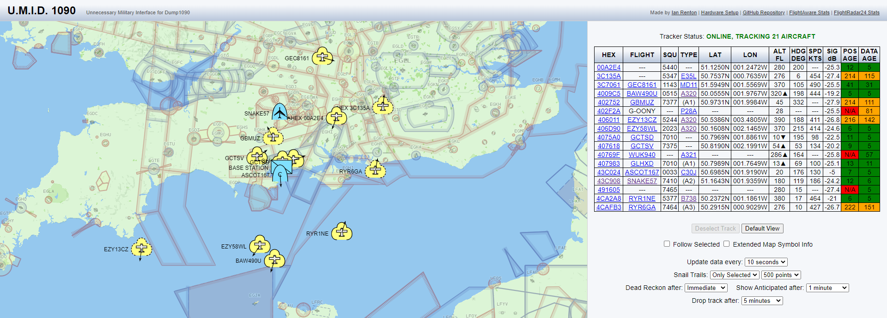

# U.M.I.D. 1090 - The Unnecessary Military Interface for Dump1090

A wholly unnecessary replacement for Dump1090's web interface for tracking ADS-B equipped aircraft.

Uses the JSON format provided by an existing Dump1090 web server, but presents it using military symbology. Just because you can, doesn't mean you should?

This was a weekend project so the code quality here is very hacky, and is missing quite a few of the features that Dump1090 has. I may revisit to add features or clean it up in future, suggestions and pull requests are always welcome.

My code in this project is subject to "The Unlicence", i.e. it's public domain and you can do what you want with it. The source repository contains some libraries (milsymbol, moment.js, latlongcalc, dbloader) that aren't mine and are subject to other licences. All are used with great thanks, see their source files for licence details.

If you want to use this for yourself, go right ahead. There are some static variables at the top of code.js that you will need to tweak to match your install; you also need your own Mapbox API key in order to get the map background working properly. The links to FlightAware and FlightRadar24 stats are in index.html, you'll want to update those too so they point to your own stats pages.
